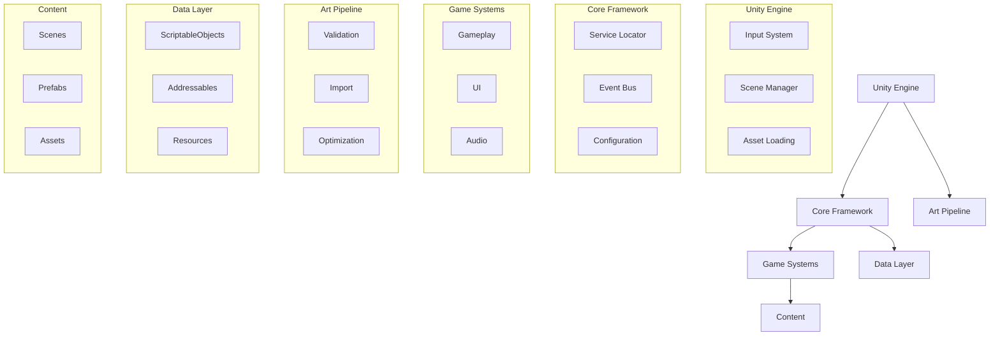
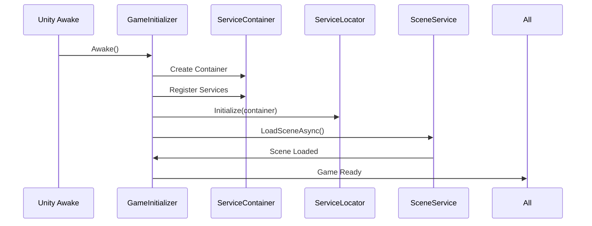
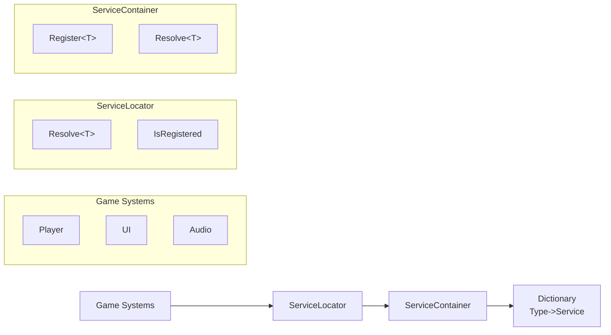
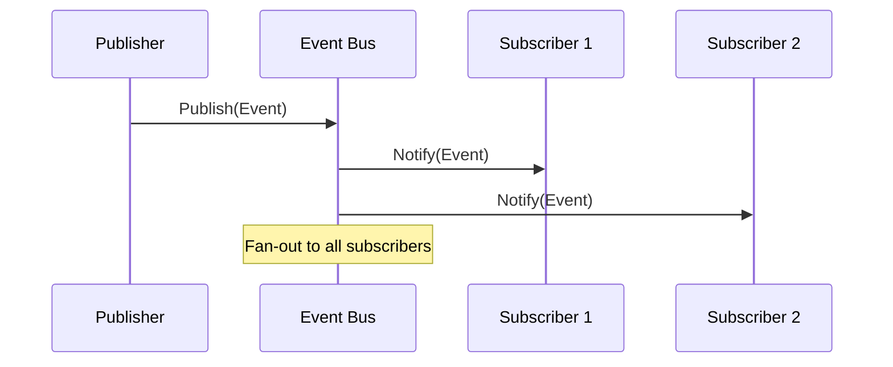
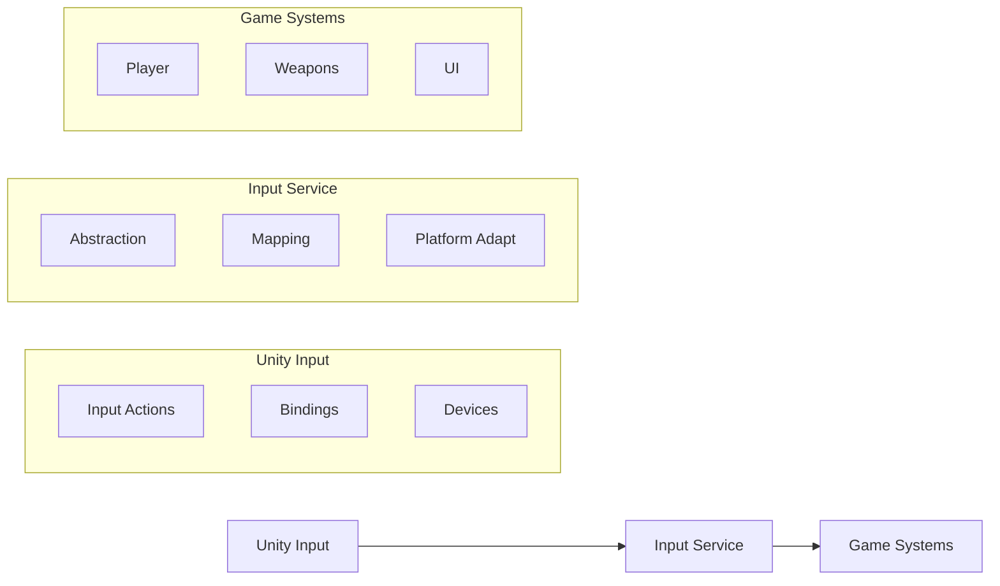
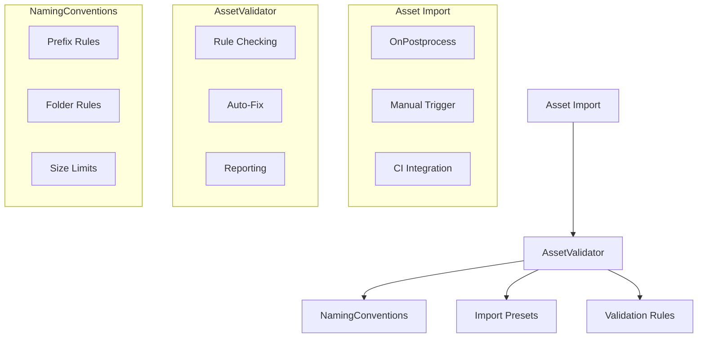
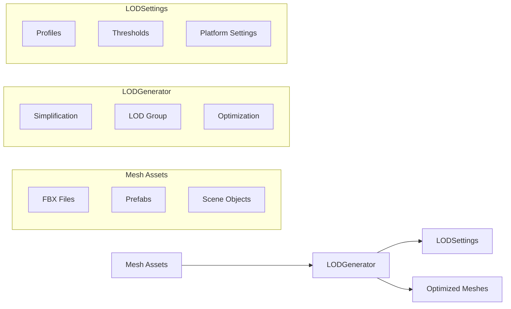
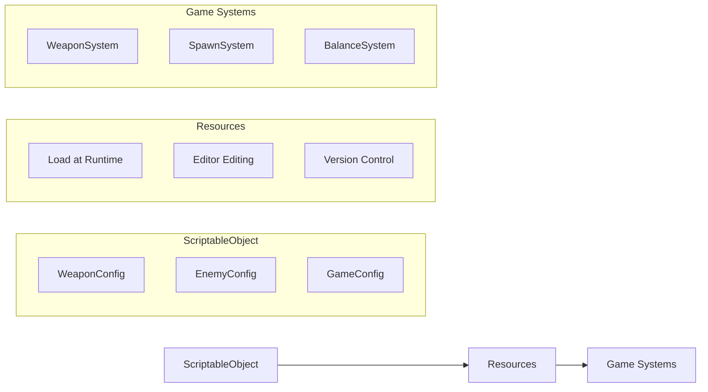
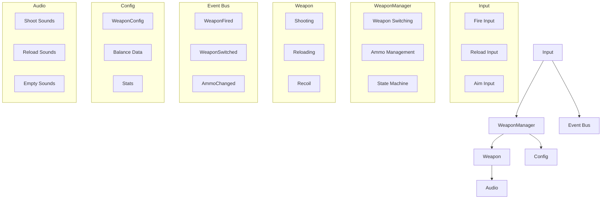

# CHROME FLESH - Architecture Documentation

## 🏗️ System Architecture Overview

### High-Level Architecture



## 🎯 Core Principles

### 1. **Dependency Inversion**
- High-level modules don't depend on low-level implementations
- All dependencies flow through interfaces
- Service Locator provides abstraction layer

### 2. **Event-Driven Communication**
- Systems communicate through events, not direct calls
- Loose coupling between components
- Easy to extend and modify behavior

### 3. **Data-Driven Design**
- Configuration through ScriptableObjects
- Easy balancing and tuning without code changes
- Designer-friendly workflow

### 4. **Separation of Concerns**
- Clear boundaries between systems
- Single responsibility for each component
- Testable, maintainable code

## 🔧 Core Framework

### 1. Boot Sequence

**Purpose**: Initialize core systems in controlled order

**Flow**:


**Key Components**:
- `GameInitializer`: Main boot controller
- `ServiceContainer`: Dependency injection
- `ServiceLocator`: Global service access

**Implementation**:
```csharp
public class GameInitializer : MonoBehaviour
{
    private void Awake()
    {
        // 1. Create service container
        _serviceContainer = new ServiceContainer();
        
        // 2. Register services
        _serviceContainer.Register<ISceneService>(new SceneService());
        _serviceContainer.Register<IEventBus>(new EventBus());
        _serviceContainer.Register<IInputService>(new InputService());
        
        // 3. Initialize global access
        ServiceLocator.Initialize(_serviceContainer);
        
        // 4. Load first scene
        StartCoroutine(LoadFirstSceneAsync());
    }
}
```

### 2. Service Locator Pattern

**Purpose**: Provide global access to core systems without tight coupling

**Architecture**:


**Usage**:
```csharp
// Any system can access services
var eventBus = ServiceLocator.Resolve<IEventBus>();
var inputService = ServiceLocator.Resolve<IInputService>();

// Safe access pattern
if (ServiceLocator.IsRegistered<ISceneService>())
{
    var sceneService = ServiceLocator.Resolve<ISceneService>();
}
```

### 3. Event Bus System

**Purpose**: Decoupled communication between systems

**Pattern**: Publish-Subscribe

**Implementation**:
```csharp
public interface IEventBus
{
    void Subscribe<T>(Action<T> callback) where T : class;
    void Unsubscribe<T>(Action<T> callback) where T : class;
    void Publish<T>(T eventData) where T : class;
}
```

**Event Flow**:


**Example Event**:
```csharp
public class PlayerHealthChangedEvent
{
    public float CurrentHealth { get; set; }
    public float MaxHealth { get; set; }
    public float DamageAmount { get; set; }
    public GameObject DamageSource { get; set; }
}

// Publishing
_eventBus.Publish(new PlayerHealthChangedEvent 
{ 
    CurrentHealth = 75f,
    MaxHealth = 100f,
    DamageAmount = 25f
});

// Subscribing
_eventBus.Subscribe<PlayerHealthChangedEvent>(OnHealthChanged);
```

### 4. Input Abstraction Layer

**Purpose**: Abstract Unity's Input System for testability and platform flexibility

**Architecture**:


**Implementation**:
```csharp
public interface IInputService
{
    Vector2 GetVector2(string actionName);
    bool GetButtonDown(string actionName);
    bool GetButton(string actionName);
    bool GetButtonUp(string actionName);
    void EnableInput();
    void DisableInput();
}
```

**Input Actions** (Centralized Constants):
```csharp
public static class InputActions
{
    public const string Move = "Move";
    public const string Look = "Look";
    public const string Fire = "Fire";
    public const string Jump = "Jump";
    public const string Reload = "Reload";
    // ... more actions
}
```

## 🎨 Art Pipeline Architecture

### 1. Asset Validation System

**Purpose**: Ensure asset quality and consistency

**Architecture**:


**Validation Rules**:
- Naming conventions (prefixes, suffixes)
- Folder structure compliance
- File size limits
- Import settings optimization
- Reference integrity

**Auto-Fix Pipeline**:
```csharp
public class AssetImportValidator : AssetPostprocessor
{
    static void OnPostprocessAllAssets(string[] importedAssets)
    {
        foreach (var assetPath in importedAssets)
        {
            var result = AssetValidator.ValidateAsset(assetPath);
            if (!result.IsValid)
            {
                TryAutoFixAsset(assetPath, result);
            }
        }
    }
}
```

### 2. LOD Generation System

**Purpose**: Automated Level of Detail optimization

**Architecture**:


**Configuration**:
```csharp
[CreateAssetMenu(menuName = "Art Pipeline/LOD Settings")]
public class LODSettings : ScriptableObject
{
    public LODProfile characterLODs;
    public LODProfile environmentLODs;
    public LODProfile weaponLODs;
    
    [Header("General Settings")]
    public bool generateCollidersForLODs;
    public bool preserveUVs;
    public float maximumSimplificationError;
}
```

### 3. Addressables Management

**Purpose**: Dynamic content loading and memory management

**Group Strategy**:
```
Addressables/
├── Characters/           # Player, enemies, NPCs
├── Weapons/             # All weapon types
├── Environment_Level_01/ # Level-specific assets
├── Environment_Level_02/
├── UI/                  # Interface elements
├── Audio_Music/         # Music tracks
├── Audio_SFX_Weapons/   # Weapon sounds
├── Audio_SFX_Characters/# Character sounds
└── Shared/              # Common materials, shaders
```

**Loading Pattern**:
```csharp
public class AssetLoader : MonoBehaviour
{
    public async Task<GameObject> LoadWeaponAsync(string weaponName)
    {
        var handle = Addressables.LoadAssetAsync<GameObject>($"PF_Weapon_{weaponName}");
        await handle.Task;
        
        if (handle.Status == AsyncOperationStatus.Succeeded)
        {
            return handle.Result;
        }
        
        return null;
    }
}
```

## 📊 Data Management

### 1. Configuration System

**Purpose**: Data-driven game design and balancing

**Architecture**:


**Example Configuration**:
```csharp
[CreateAssetMenu(menuName = "Configs/Weapon Config")]
public class WeaponConfig : ScriptableObject
{
    [Header("Combat Stats")]
    public float Damage = 25f;
    public float FireRate = 600f; // RPM
    public float Range = 100f;
    
    [Header("Ammo")]
    public int MagazineSize = 30;
    public float ReloadTime = 2.5f;
    
    [Header("Recoil")]
    public Vector2 RecoilPattern = Vector2.one;
    public float RecoilRecovery = 0.5f;
    
    [Header("Audio")]
    public AudioClip ShootSound;
    public AudioClip ReloadSound;
}
```

### 2. Save System Architecture

**Purpose**: Persistent game state management

**Layers**:
```csharp
public interface ISaveSystem
{
    Task SaveGameAsync(GameState gameState);
    Task<GameState> LoadGameAsync();
    bool SaveExists { get; }
}

public class GameState
{
    public PlayerProgress Player { get; set; }
    public WorldState World { get; set; }
    public SettingsState Settings { get; set; }
}
```

## 🎮 Game Systems Architecture

### 1. Player System

**Components**:
```csharp
public class PlayerController : MonoBehaviour
{
    private IInputService _input;
    private IEventBus _eventBus;
    private HealthSystem _health;
    private WeaponSystem _weapons;
    
    private void Update()
    {
        HandleMovement();
        HandleWeaponInput();
    }
}

public class HealthSystem : MonoBehaviour
{
    public float CurrentHealth { get; private set; }
    public float MaxHealth { get; private set; }
    
    public void TakeDamage(float damage, GameObject source)
    {
        CurrentHealth -= damage;
        _eventBus.Publish(new PlayerHealthChangedEvent 
        { 
            CurrentHealth = CurrentHealth,
            DamageAmount = damage,
            DamageSource = source
        });
    }
}
```

### 2. Weapon System

**Architecture**:


### 3. Enemy AI System

**Pattern**: Behavior Tree + State Machine

```csharp
public class EnemyAI : MonoBehaviour
{
    private BehaviorTree _behaviorTree;
    private EnemyState _currentState;
    private PerceptionSystem _perception;
    
    private void Update()
    {
        _behaviorTree.Update();
        UpdateState();
    }
}

public abstract class EnemyState
{
    public abstract void Enter();
    public abstract void Update();
    public abstract void Exit();
}

public class ChaseState : EnemyState
{
    public override void Update()
    {
        // Chase logic using pathfinding
    }
}
```

## 🔌 Integration Patterns

### 1. System Initialization

**Boot Sequence**:
```csharp
public class GameInitializer : MonoBehaviour
{
    private async void Awake()
    {
        // Phase 1: Core Services
        InitializeCoreServices();
        
        // Phase 2: Game Systems
        await InitializeGameSystems();
        
        // Phase 3: Content Loading
        await LoadInitialContent();
        
        // Phase 4: Game Ready
        _eventBus.Publish(new GameReadyEvent());
    }
}
```

### 2. Scene Management

**Pattern**: Asynchronous scene loading with progress tracking

```csharp
public class SceneService : ISceneService
{
    public async Task<SceneLoadResult> LoadSceneAsync(string sceneName, 
        IProgress<float> progress = null)
    {
        var operation = SceneManager.LoadSceneAsync(sceneName);
        
        while (!operation.isDone)
        {
            progress?.Report(operation.progress);
            await Task.Yield();
        }
        
        return new SceneLoadResult { Success = true };
    }
}
```

### 3. Error Handling & Recovery

**Pattern**: Graceful degradation with fallbacks

```csharp
public class WeaponSystem : MonoBehaviour
{
    public async Task<bool> EquipWeapon(string weaponId)
    {
        try
        {
            var weaponPrefab = await _assetLoader.LoadWeaponAsync(weaponId);
            if (weaponPrefab != null)
            {
                InstantiateWeapon(weaponPrefab);
                return true;
            }
            
            // Fallback to default weapon
            return await EquipDefaultWeapon();
        }
        catch (Exception ex)
        {
            Debug.LogError($"Failed to equip weapon {weaponId}: {ex.Message}");
            return await EquipDefaultWeapon();
        }
    }
}
```

## 🚀 Performance Architecture

### 1. Memory Management

**Patterns**:
- Object pooling for frequently instantiated objects
- Addressables for dynamic loading/unloading
- LOD systems for geometry optimization
- Texture streaming and mipmapping

### 2. Update Optimization

**Pattern**: Phased updates with priority system

```csharp
public class UpdateManager : MonoBehaviour
{
    private List<IUpdateable> _highPriority = new();
    private List<IUpdateable> _normalPriority = new();
    private List<IUpdateable> _lowPriority = new();
    
    private void Update()
    {
        // High priority: Input, combat
        foreach (var system in _highPriority)
            system.OnUpdate(Time.deltaTime);
            
        // Normal priority: AI, physics
        foreach (var system in _normalPriority)
            system.OnUpdate(Time.deltaTime);
            
        // Low priority: Visual effects, ambient systems
        foreach (var system in _lowPriority)
            system.OnUpdate(Time.deltaTime);
    }
}
```

### 3. Asset Streaming

**Strategy**: Predictive loading based on player position and progression

```csharp
public class StreamingController : MonoBehaviour
{
    public async Task PreloadLevelAssets(string levelName)
    {
        var dependencies = await GetLevelDependencies(levelName);
        await Addressables.LoadAssetsAsync(dependencies, null);
    }
    
    public async Task UnloadUnusedAssets()
    {
        await Resources.UnloadUnusedAssets();
        await Addressables.CleanBundleCache();
    }
}
```

## 🔍 Testing Architecture

### 1. Unit Testing

**Pattern**: Mock services for isolated testing

```csharp
[TestFixture]
public class WeaponSystemTests
{
    private Mock<IEventBus> _eventBusMock;
    private Mock<IInputService> _inputServiceMock;
    private WeaponSystem _weaponSystem;
    
    [SetUp]
    public void Setup()
    {
        _eventBusMock = new Mock<IEventBus>();
        _inputServiceMock = new Mock<IInputService>();
        
        _weaponSystem = new WeaponSystem(_eventBusMock.Object, _inputServiceMock.Object);
    }
    
    [Test]
    public void Shooting_Decreases_Ammo()
    {
        // Arrange
        _weaponSystem.CurrentAmmo = 30;
        
        // Act
        _weaponSystem.Shoot();
        
        // Assert
        Assert.AreEqual(29, _weaponSystem.CurrentAmmo);
    }
}
```

### 2. Integration Testing

**Pattern**: In-editor testing with scene setup

```csharp
[UnityTest]
public IEnumerator Player_Takes_Damage_From_Enemy()
{
    // Arrange
    var player = InstantiatePlayer();
    var enemy = InstantiateEnemy();
    
    var initialHealth = player.Health.CurrentHealth;
    
    // Act
    enemy.Attack(player);
    yield return new WaitForSeconds(0.1f);
    
    // Assert
    Assert.Less(player.Health.CurrentHealth, initialHealth);
}
```

## 🔄 Development Workflow

### 1. Feature Development Process
```
1. Design → 2. Implement Core → 3. Create Tests → 4. Integrate → 5. Validate
```

### 2. Asset Pipeline
```
Artist Creates → Auto-Validation → Addressables Build → Runtime Loading
```

### 3. CI/CD Pipeline
```
Code Commit → Asset Validation → Unit Tests → Build → Deploy
```

---

*Last Updated: 2025.10.11*
